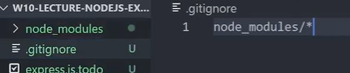

# Getting Started with Express JS

In this section, we will go over the steps to installing and creating our first file.

## Creating our file

<br>1 Select new file that you will be creating


.png>)


<br>2 Name our file to whatever name of your choice, make sure to include **.js** at the end<
.png>)

## Getting Started with Express JS

Next we will install Express from the terminal

<br>3 Navigate to the terminal window by going to **VIEW --> TERMINAL**

- This can also be done with the shortcut: \_(CTRL + SHIFT + `)

<br>4 Once the terminal has opened, click into it<br>

- Type the following into the terminal: _npm install express_

```
npm install express
```

## Copy over the boilerplate code

<br>5 We will next copy over the boilerplate code provided to us by Express<br>

```
const express = require('express')
const app = express()
const port = 3000

app.get('/', (req, res) => {
  res.send('Hello World!')
})

app.listen(port, () => {
  console.log(`Example app listening on port ${port}`)
})
```

- this code can also be found on the [Express JS Setting Started](https://expressjs.com/en/starter/installing.html) website

## Getting started with npm

<br>6 Navigate to the terminal window by going to **VIEW --> TERMINAL**<br>

- This can also be done with the shortcut: _(CTRL + SHIFT + `)_

<br>7 Once the terminal has opened, click into it<br>
.png>)

- Type the following: _npm init_

```
npm init
```

- After we have typed **npm init**, we will be asked to enter details about our file<br>
<br>8 Continuously press _ENTER_ until all done

## Checking our steps

<br>9 Navigate to the newly created **package.json** that npm has created for us<br>
.png>)

<br>10 Verify the names inside **package.json** match what we have installed
    .png>)

To verify we did the last steps correctly, type the following into the terminal: _node .\filename_

```
node .\filename
```

<br>11 Finally add a .gitignore file to our project, this will allow us to upload our file to github<br>

