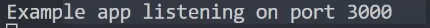

# Getting Started with Express JS

In this section, we will go over the steps to installing and creating our first file.

## Creating our file

<br>**1** Hover over the new file button and select a new file<br>

.png>)

<br>**2** Name the file to whatever name you prefer, make sure to include **.js** at the end
.png>)

## Getting Started with Express JS

Next we will install Express from the terminal

<br>**3** Navigate to the terminal window by going to **VIEW --> TERMINAL**

!!! info "Info"

    This can also be done with the shortcut: \_(CTRL + SHIFT + `)

<br>**4** Once the terminal has opened, click into it and type the following into the terminal: _npm install express_

```
npm install express
```

## Copy over the boilerplate code

<br>**5** Locate back to your new file, and then paste the boilerplate code that can be copied below

```
const express = require('express')
const app = express()
const port = 3000

app.get('/', (req, res) => {
  res.send('Hello World!')
})

app.listen(port, () => {
  console.log(`Example app listening on port ${port}`)
})
```

!!! info "Info"

    This code can also be found on the [Express JS Setting Started](https://expressjs.com/en/starter/installing.html) website

## Getting started with npm

<br>**6** Navigate back to the terminal window if it's no longer open by going to **VIEW --> TERMINAL**<br>

!!! info "Info"

    This can also be done with the shortcut: _(CTRL + SHIFT + `)_

<br>**7** Once the terminal has opened, click into it and type the following: _npm init_<br>
.png>)

```
npm init
```

!!! info "Info"

    After we have typed **npm init**, we will be asked to enter details about our file

<br>**8** Leave all default parameters by continuously press _ENTER_ until all done

<br>**9** Type the following into the terminal:
```
npm install express
```

<br>**9** Once packages have been installed, verify that the messages inside **package.json** match the image below<br>
.png>)

## Checking our steps

<br>**10** Navigate to the newly created **package.json** that npm has created for us<br>
.png>)
<br>**11** To verify we did the last steps correctly, type the following into the terminal: _node .\filename_

```
node .\filename
```


