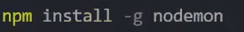
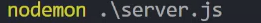
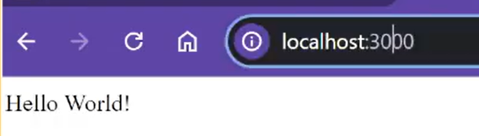
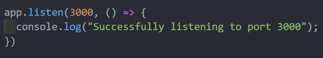

# Connecting to Github and Installing Nodemon

The following steps will explain how to connect our newly created file to your github, as well as install nodemon.
Nodemon will allow us to view our file and have it auto update, which will aleviate unecessary repitition.

## Github

<br>**1** Intiliaze github in VSCode
<br>**2** Check our file by typing the following in the terminal: _node .\filename_

```
node .\filename
```

<br>**3** Add the names of the files we created in the previous step to **.gitignore (node_module/\*)**
.png>)

## Installing Nodemon

<br>**4** nagivate to the terminal as we did in our last step **(VIEW --> TERMINAL)** and type the following: _npm install -g nodemon_

```
npm install -g nodemon
```



<br>**5** We will start Nodemon by typing the following in the terminal: _nodemon .\filename.js_

```
nodemon .\filename.js
```



## Testing our file with Nodemon

<br>**6** Open up a browser and type the following: _localhost:3000/_

```
localhost:3000/
```


<br>**7** Return back to the file and modify hello world response
<br>**8** Change the port number from **3000** to another number from **1-64536**

