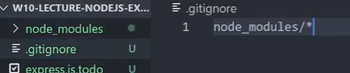

# Connecting to GitHub and Installing Nodemon

The following steps will explain how to connect our newly created file to your GitHub, as well as install nodemon.
Nodemon will allow us to view our file and have it auto update, which will alleviate unnecessary repitition.

## GitHub

<br>**1** Intiliaze GitHub in vsCode by typing the following one line at a time:

```
git intit -b main
```

```
git add .
```

```
git commit -m
```

<!-- <br>**2** Add the names of the files we created in the previous step to **.gitignore (node_module/\*)**
.png>)
!!! success "Success"

    Your page should look like this: <br>
     -->

<br>**2** Let's quickly check our file by typing the following in the terminal and changing it to match the file's name:

```
node .\server.js
```

## Installing Nodemon

<br>**3** Nagivate to the terminal as we did in our last step **(VIEW --> TERMINAL)** and type the following: _npm install -g nodemon_

```
npm install -g nodemon
```


<br>**4** We will start Nodemon by typing the following in the terminal: _nodemon .\filename.js_

```
nodemon .\filename.js
```


## Testing our file with Nodemon

<br>**5** Open up a browser and type the following: _localhost:3000/_

```
localhost:3000/
```

!!! success "Success"

    Your page should look like this:
    

<br>**6** Return back to your VSCode file bolierplate and locate app.get and replace our **app.get** boilerplate from earlier to your own custom message

```
app.get('/', (req, res) => {
  res.send('Hello World!')
})
```

<br>**7** Change the port number from **3000** to another number from **1-64536**, for this example we used **1234**

