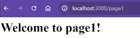

# Using Get\Send\Listen

In the next steps, we will go over how to start using get, send and listen in Express JS.

## Use the Get Request Boilerplate

<br>**1** Copy the Get request provided and paste it into your file<br>

```
const express = require('express')
const app = express()
const port = 3000

app.get('/', (req, res) => {
res.send('Hello World!')
})

app.listen(port, () => {
console.log(`Example app listening on port ${port}`)
})
```

!!! info "Info"

    The boilerplate code can also be found at this [website](https://expressjs.com/en/starter/hello-world.html)

## Getting started with res.send

- Next, we will explain how res.send will send a message
  <br>**2** Type the following in the terminal: **node .\filename**<br>

```
node .\filename
```

!!! info "Info"

    In the same terminal, the program can be stopped by typing the following: **CTRL + UPPERCASE C\_**

<br>**3** Copy the following code into your vsCode, which will send our first message<br>

```
app.get("/", (req, res) => {
    res.send("<h1> Welcome to my first site!</h1>")
})
```

## Testing our app.listen

- Now we wil text our **app.listen** message to view what we just created with res.send

<br>**4** open up a browser of your choice and type: _localhost:3000_<br>

```
localhost:3000
```

<br>**5** Check our generic message<br>
!!! success "Success"

    

## Using res.send for a new page

<br>**6** Now we will go back to vsCode to send a message to a new page. Copy the following code:<br>

```
app.get("/page1", (req, res) => {
    res.send("<h1> Welcome to page1!</h1>")
})
```

<br>**7** Lets test this page by the /page route and check our result <br>
!!! success "Success"

    
