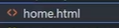
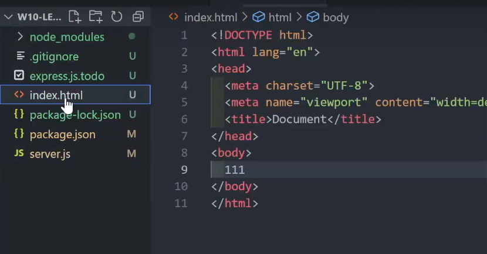
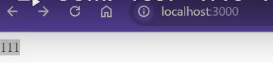
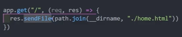
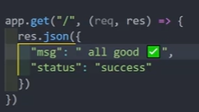
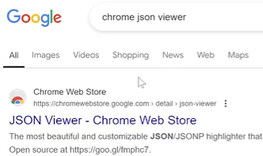
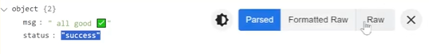

# Connecting a website using Express

In these steps, we will finally connect our web page using express.

## Creating a template HTML page

<br>**1** Create a new html file

- Name the file: _home.html_



<br>**2** Once the file is created, click into it<br>
!!! info "Info"
At the top of the page, we will be utilizing a shortcut to make a boilerplate html page
<br>**3** Copy the following text and paste it into your new file<br>

```
<!DOCTYPE html>
<html lang="en">
<head>
    <meta charset="UTF-8">
    <meta name="viewport" content="width=device-width, initial-scale=1.0">
    <title>Document</title>
</head>
<body>

</body>
</html>
```

<br>**4** Add a message inside the<br>


<br>**5** Lets verify that our html page is working by checking our localhost:3000!<br>
!!! success "Success"

    Your page should look like this:
    

## Connecting our website through express

<br>**6** Go back to our other file where the .send is<br>

- copy the destination path to the html page we just created
- Update our app.get

  

## Testing our new website with app.get

!!! info "Info"

    With our new get request, we can now test our new website!

<br>**7** lets add a messgae to our json object<br>


<br>**8** navigate to localhost:3000 and you should see the new addition<br>
!!! success "Success"

    Your page should look like this:
    [jsonViewer](./Task4/jsonViewTest.png)

## Installing json viewer and testing our new website

<br>**9** go to extensions page <br>

- search for json viewer
- download extension
- use extension to test our website



<br>**10** selecting the parse option will allow us to see our json object in a user friendly way<br>
!!! success "Success"

    Your page should look like this:
    
