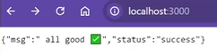

# Connecting a website using Express

In these steps, we will finally connect our web page using express.

## Creating a template HTML page

<br>**1** Create a new html file and name the file: _home.html_ within the folder 


<br>**2** Once the file is created, click into it<br>
!!! info "Info"

    At the top of the page, we will be utilizing a shortcut to make a boilerplate html page

<br>**3** Copy the following text and paste it into your new file<br>

```
<!DOCTYPE html>
<html lang="en">
<head>
    <meta charset="UTF-8">
    <meta name="viewport" content="width=device-width, initial-scale=1.0">
    <title>Document</title>
</head>
<body>

</body>
</html>
```

<br>**4** Add a message between the body tags as can be seen below<br>


## Connecting our website through express

<br>**5** Return to our other file where the .send is<br>

- Copy the destination path to the html page we just created
- Update our app.get

  

<br>**6** Let's verify that our html page is working by checking our **localhost:3000!**<br>
!!! success "Success"

    Your page should look like this: <br>
    


## Testing our new website with app.get

!!! info "Info"

    With our new get request, we can now test our new website!

<br>**7** Let's add a messgae to our json object<br>


<br>**8** Navigate to **localhost:3000** and you should see the new addition<br>
!!! success "Success"

    Your page should look like this: <br>
    
<!-- 
## Installing json viewer and testing our new website -->

<!-- <br>**9** Navigate to the extensions page <br>

- Search for *json viewer*
- Download the extension
- Use extension to test our website


<br>**10** Selecting the parse option will allow us to see our json object in a user friendly way<br>
!!! success "Success"

    Your page should look like this: <br>
     -->
